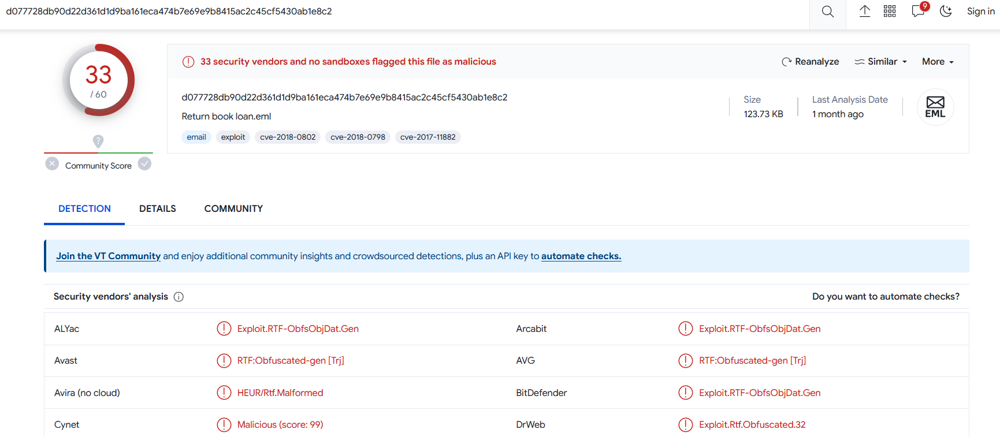
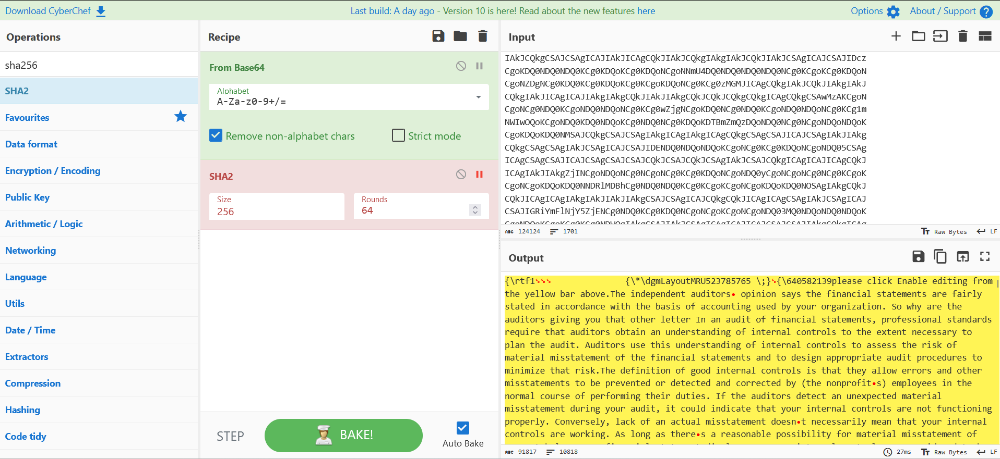
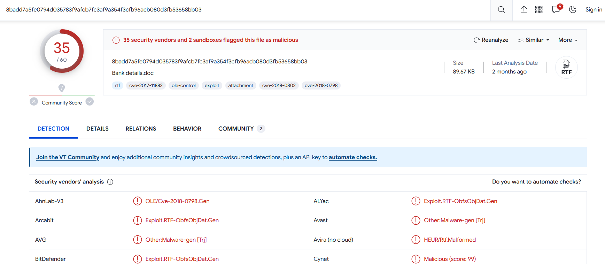
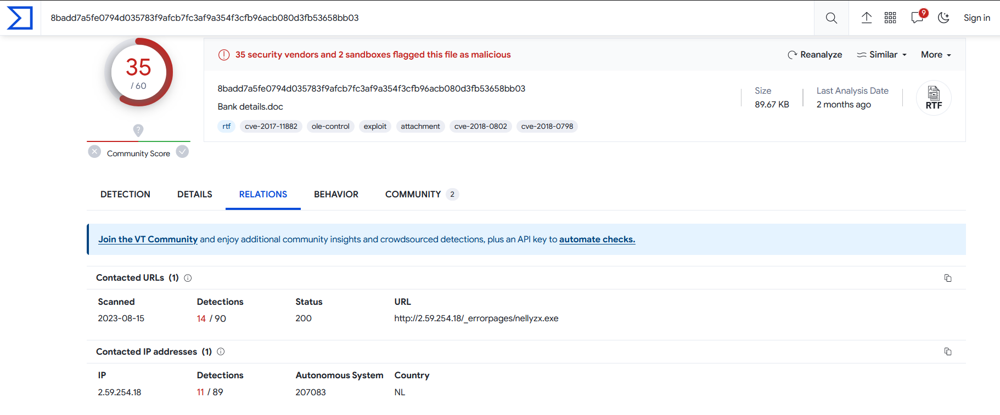
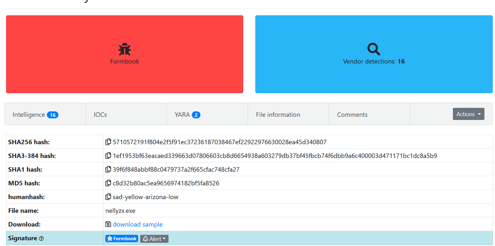

# Fill the library

We got a mail :

```
$ sha256sum Return\ book\ loan.eml
d077728db90d22d361d1d9ba161eca474b7e69e9b8415ac2c45cf5430ab1e8c2  Return book loan.eml
```

Check on VT :


Extract the attachment of the mail and decode it with Cyberchef:



We notice that the file named "Bank details.doc" is in reality a rtf file 

```
$ sha256sum download.rtf
8badd7a5fe0794d035783f9afcb7fc3af9a354f3cfb96acb080d3fb53658bb03  download.rtf
```

Check on VT :


We could analyse it with rtfdump :
```
$ python2 ../../../DidierStevensSuite/rtfdump.py download.rtf
    1 Level  1        c=    2 p=00000000 l=   91815 h=    7545;      18 b=       0   u=    7457 \rtf1
    2  Level  2       c=    0 p=0000000d l=      27 h=      10;       9 b=       0   u=       8 \*\dgm
    3  Level  2       c=    1 p=0000002b l=   91771 h=    7545;      18 b=       0   u=    7457
    4   Level  3      c=    2 p=0000315c l=   79177 h=    3328;      18 b=       0 O u=       0
      Name: 'EQuAtIon.3\x00' Size: 1621 md5: e29969b945c96f8cd744f8b38ceb34da magic: 027eb9eb
    5    Level  4     c=    0 p=00003183 l=      46 h=       0;      18 b=       0   u=       0 \qmspace903956706
    6    Level  4     c=    0 p=000031b4 l=      45 h=       0;      18 b=       0   u=       0 \*\urtf561884577
```

```
$ python2 ../../../DidierStevensSuite/rtfdump.py -f O download.rtf
    4   Level  3      c=    2 p=0000315c l=   79177 h=    3328;      18 b=       0 O u=       0
      Name: 'EQuAtIon.3\x00' Size: 1621 md5: e29969b945c96f8cd744f8b38ceb34da magic: 027eb9eb
```

```
$ python2 ../../../DidierStevensSuite/rtfdump.py -s 4 download.rtf
$ python2 ../../../DidierStevensSuite/rtfdump.py -s 4 -Hi download.rtf
Name: 'EQuAtIon.3\x00'
Position embedded: 00000023
Size embedded: 00000655
md5: e29969b945c96f8cd744f8b38ceb34da
magic: 027eb9eb
```

To identify which malware family this sample belongs to, we can navigate to the VirusTotal relationship page and find the URL that communicates with our RTF.

We see that the rtf tries to contact the ip 2.59.254.18 to download the executable nellyzx.exe


GCC-CTF{CVE-2017-11882_CVE-2018-0798_CVE-2018-0802:EQuAtIon.3:Formbook}