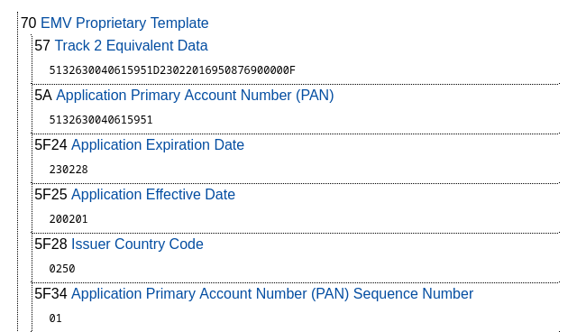

# Bad Habit

We open the file in Wireshark and we see 7062 USB packets including 442 using the sub-protocol USBCCID. Googling "USBCCID" leads to smart cards so it should be what we are looking for.

If we filter only USBCCID packets and browse them we can see strings like "1PAY.SYS.DDF01" and "MASTERCARD", confirming that we've filtered out some interesting packets.

According to Google and Wikipedia, credit cards use EMV protocol to communicate.

Let's remove USB headers and print data (with source to see direction of communication):

```txt
tshark -Y "usbccid" -r usb.pcapng -T fields -e usb.src -e data > communication.txt
```

According to [this site](https://hpkaushik121.medium.com/understanding-apdu-commands-emv-transaction-flow-part-2-d4e8df07eec) commands starting with `00B2` are `READ RECORD` instructions.

We search tools to parse the data sent by the smart card and we find this tool: [TLV Utils](https://emvlab.org/tlvutils/). We copy data sended by the card and [one of them](https://emvlab.org/tlvutils/?data=7081a857135132630040615951d23022016950876900000f5a0851326300406159515f24032302285f25032002015f280202505f3401018c279f02069f03069f1a0295055f2a029a039c019f37049f35019f45029f4c089f34039f21039f7c148d12910a8a0295059f37049f4c089f02069f03068e0a00000000000000001f039f0702ff009f080200039f0d05b4606080009f0e0500100000009f0f05b4606098009f420209) contains the following information:



PAN is the technical name of the "credit card number" and we have the expiration date (`YYMMDD` format). The expiration date if the last day of the month printed on the card, i.e. `02/23`.

The flag is: `GCC{5132630040615951|02/23}`
