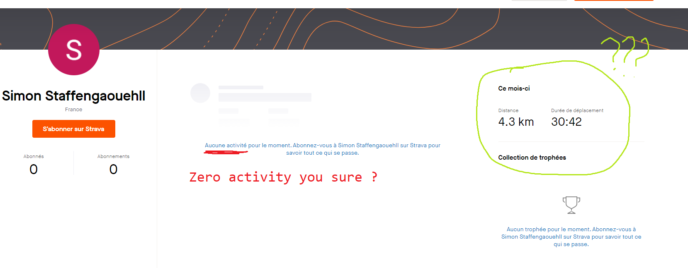
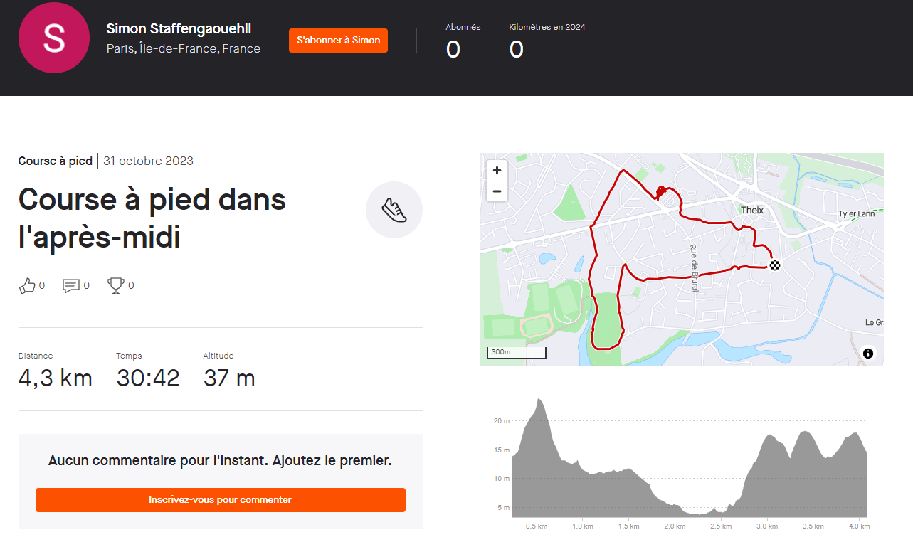
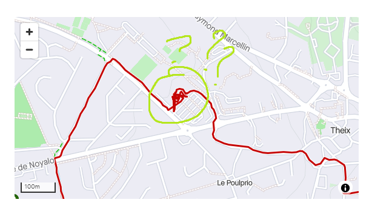
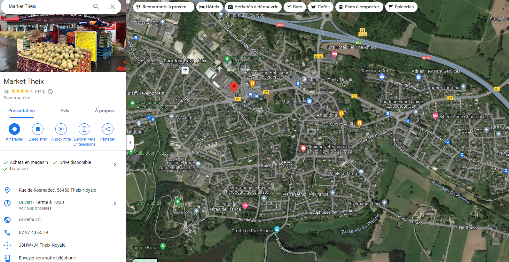
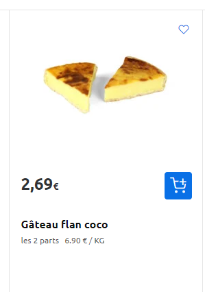
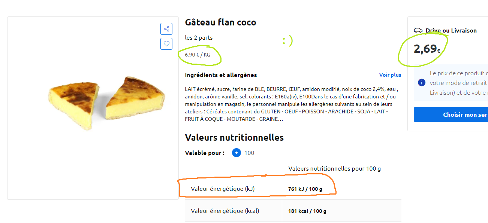

# But they so tasty ... 😔🍰

Initial intel :
- Sport ("running")
- Food ("2 coconut flan slices", "kilo Jouls")
- surname "Staffengaouehll"

## Search for "Staffengaouehll"

Google: ``nothing :/``

Username search sites or scripts: ``nothing :/ Well currently``

Hmmmm really sneaky man. Let's go back to our intel. Let's search for Sport websites!
- Strava
- Apple health
- AllTrails
- Komoot
- Adidas Running
- ...

## Let's start with Strava! :)

We search and find one account!!! https://www.strava.com/athletes/126771692

> [!NOTE] ``https://www.strava.com/athletes/search`` behaves """weirdly""" (maybe blocking traffic not using a referer from Strava.com) and blocks outsides queries. Meaning we need to search from the site, it is the reason why most Username search engines get false positives searching Strava.

But it is empty...

**Fun fact: Strava needs an account to ~~stalk~~ watch someone's activity :)**

So now we have one running session! https://www.strava.com/activities/10136656435

Hmmmmmm

## Where do the ~~babies~~ 2 coconut flan come from ?

So he spent a lot of time in a supermarket. It is not too far fetched (at least according to my chall's reviewer) that he bought the flan from this supermarket.

The supermarket is under the ``Carrefour`` franchise. No website or any information online can be found about flan slod in this specific supermarket.

There are local promotion magazines with no info about flan slices. BUT there is a search for available products in the *Drive* section! Tho I strongly advice not to use it as the *availibility* of a product in one specific supermarket is *very blurry on purpose*. They will moslty find your product available everywhere.

So let's use the main search feature! We can search for "flan" and jump from links to link or directly translate in french "coconut flan" to search for "flan noix de coco" ... the latter gives us nothing :/ Yeah sorry you need to search for "flan coco" instead ... Just jump from links to links.

*✩°｡𓍢ִ໋Hello boyyyyyyy˚｡⋆˚♡* https://www.carrefour.fr/p/gateau-flan-coco-3523680276581

## *Slaps flan* This bad boy can fit so many *Jouls*

BrØther...

So, we have the calorific value in kJ for every 100g

We have the price for 2 slices

We have the price for 1kg of cocnut flan

#### Math ?!?!

For once you won't do trig' in OSINT but basic math

$${2,69 \over 6,90} \times {1000} \times {761 \over 100} \approx 2966.7 \space kJ$$

``GCC{2967_m1ghT_b3_t0o_MucH}``