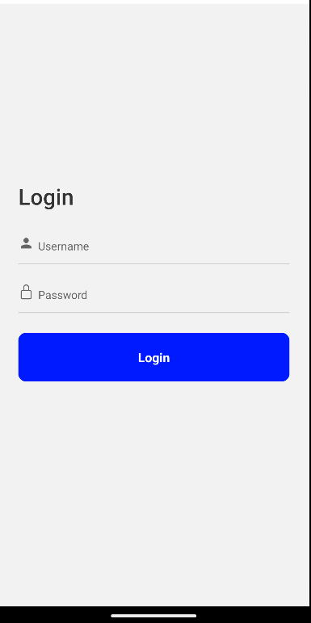
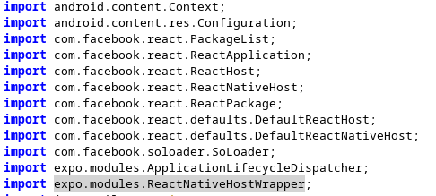
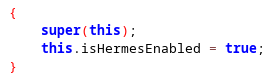
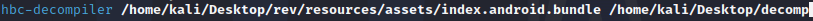
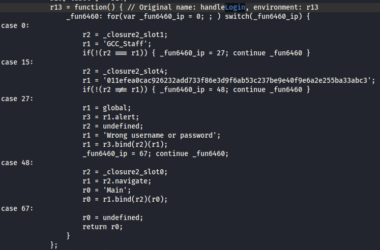
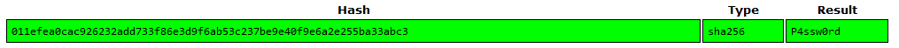
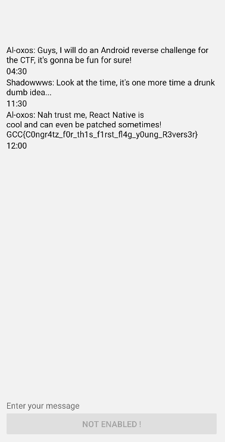

# GCC_Chat 1/2
> Author: Al-oxos

## Recon

The first thing to do when faced with an apk is to install and run it on a smartphone/emulator. 
Once launched, we get the following page : 

Nothing very interesting on this page, but we know from the challenge statement that we need to find a valid account somewhere in the application sources.

So we're going to extract the contents of our apk file to obtain the application's sources. To do this, we'll use JADX and then read the contents of the various files.
Looking first at the Main Application file, we can see the following : 

## Challenge solve

The interesting thing to see here is that we are using the React Native framework, and that the Hermes VM is enabled, which mean that we have a bundle file (here named index.android.bundle) compiled using Hermes and turned into HBC (Hermes Bytecode). This kind of files can be reversed and decompiled using various tools, for this first part i will use HBC-Decompiler (from [this](https://github.com/P1sec/hermes-dec) github) because it output some pseudocode more understandable (it try to recreate functions).

This output us a text file, now we just have to look at the reversed code. Because we know we have a login page, we can just search for a login function. By looking a little, we find the function handleLogin which seem really interesting : 

Here it appear to be pretty easy to understand, we have a comparison between the input string and the username, which appears to be GCC_Staff. If the username matches, we continue with the password comparison; if it doesn't, we alert ('Wrong username or password').
For the password, it's the same functionnement but if you try it directly it wont work, this is because the password entered is compared with the hash we see at r1, putting it on crackstation give us the working password (it might appear to be guessing, but in fact you can find a function called convertSha just before our handleLogin function) :

You can now login with these credentials : username = GCC_Staff and password = P4ssw0rd. We are redirected on a new page and we get the first flag ! 

