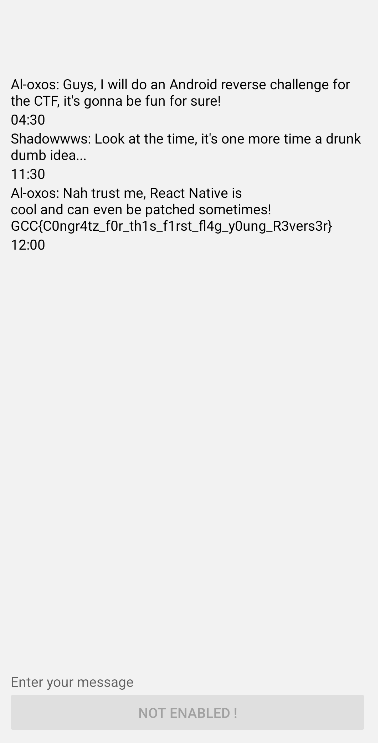
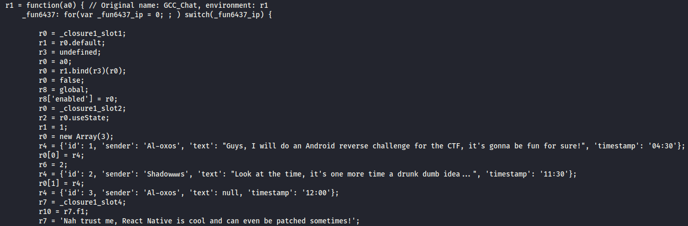
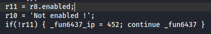
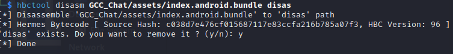
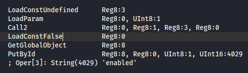
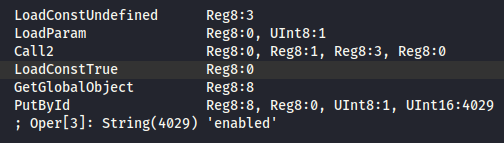
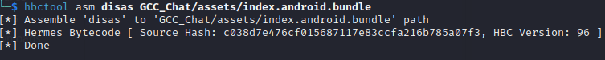
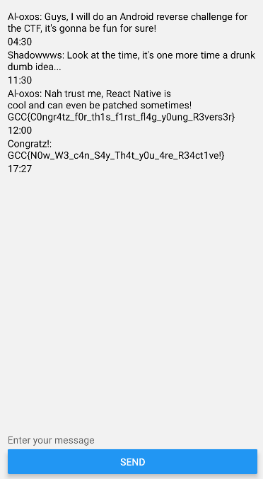

# GCC_Chat 2/2
> Author: Al-oxos

## Recon

After getting the first flag we arrive on a brand new page, with some messages (nothing really helpfull except that we can sometimes **patch** the application).
The description of the challenge tell us that we need to send the message 'Gimme that flag you silly boy!'. 
It is now pretty clear, we have to find a way to patch the application in order to activate the button and send the message. 

Looking for some of the string this page show us inside the decompiled source code give us the name of the page we currently are seeing, which is GCC_Chat: 

We can instantly see something interesting for us in this page, a variable is called enabled and we give it the value false.
To be sure we are going the good way, we can search for the string enabled and see if it's the good variable.

It's definitely the right variable, now how are we going to patch our application? Some resources give an interesting overview of how to patch native react applications (like [this one](https://www.linkedin.com/pulse/reverse-engineering-lovebox-react-native-app-high-level-zagaria-vmhre)).
The solution I've come up with (which is not exhaustive, as several methods could surely be exploited) is to use the [hbctool](https://github.com/bongtrop/hbctool) tool (a tool for disassembling and assembling Hermes bytecode files) to patch our application. 
The main problem we face is that the application has been compiled with version 96 of the Hermes VM (the last one), which is not compatible with the tool. For this reason, I modified the tool myself and added support for version 96 (initially for work purposes, the modified tool is now publicly available on [my github](https://github.com/Al-oxos/hbctool)).

## Challenge solve

So now that we have hbctool working for HBC version 96, we just have to use it to dissasemble and assemble our modified app + zipalign and sign it.

We can now look for the enabled variable inside our file .hasm and modify the instruction from LoadConstFalse to LoadConstTrue :

Now, we juste have to save the file and use the asm command on our bundle file in order to modify the app.

Now we can rebuild our app using apktool and sign it using ubersigner 

We connect on the patched app, send the message and we got the second flag :

Congratulation, you learned how to reverse and patch a react native application ! :)

